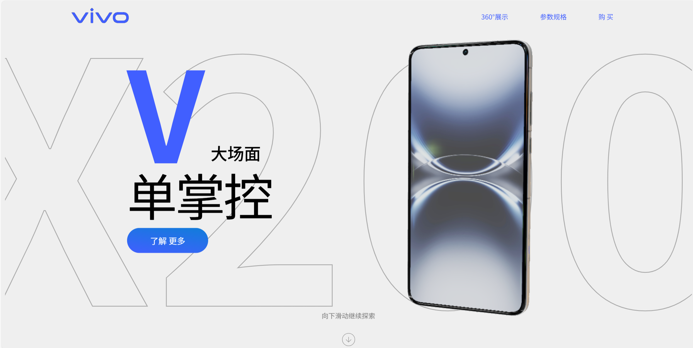

# WebGi vivox200ultra 产品页面
借鉴了项目: [camera-webgi](https://github.com/ektogamat/camera-webgi),使用 Gsap、ScrollTrigger 和 webgi 引擎构建可滚动页面。

### 实时链接: [https://www.vivo-x200ultra.asia](https://www.vivo-x200ultra.asia/)


通过webgi渲染模型以允许具有良好性能和易用性的效果渲染。通过Gsap库中的ScrollTrigger和ScrollSmoother让页面根据滚动来展现模型细节和信息。
<br>
<strong>by liQingning</strong>

<hr>

## Running
First install the dependencies:
```bash
npm install
```

To run the project in development mode:
```bash
npm run dev
```
Then navigate to [http://localhost:5173/index.html](http://localhost:5173/index.html) in a web browser to see the default scene in a viewer.

The assets are stored in the `assets` directory.

To build the project for production:
```bash
npm run build
```

## Updates
Check the [webgi manual](https://webgi.xyz/docs/manual/#sdk-links) for the latest version.
To use the different version:
* Update the version number in `package.json` file for both `webgi` and `@types/webgi`.
* Run `npm install` to update the dependencies.
* Run `npm run dev` or `npm run build` to run or build the project.

## Documentation
For the latest version and documentation: [WebGi Docs](https://webgi.xyz/docs/).

## License 
For license and terms of use, see the [SDK License](https://webgi.xyz/docs/license).
